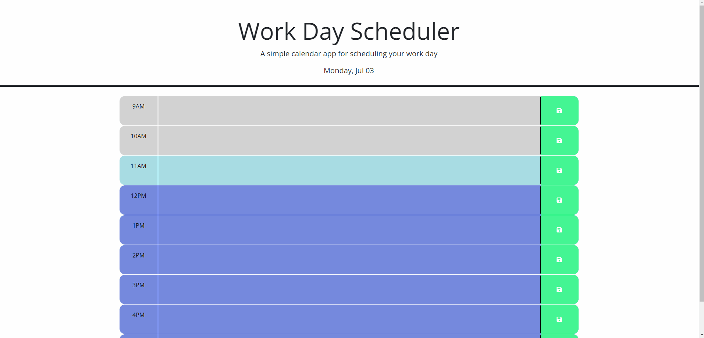

# work-day-scheduler

## Description

With this workday scheduler, you are displayed the current day of the week as well as the number day. You get to see a schedule from 9am - 5pm where can write events into each time block and then click the save icon folder. This will store your events into localstroage. Depending on the current time each block will display a color indicating whether the time block is in the past, present, or future. To display the current time I used dayjs() in js as well used jQuery.

## Deployment

https://jasonmattheww.github.io/work-day-scheduler/

## Usage

